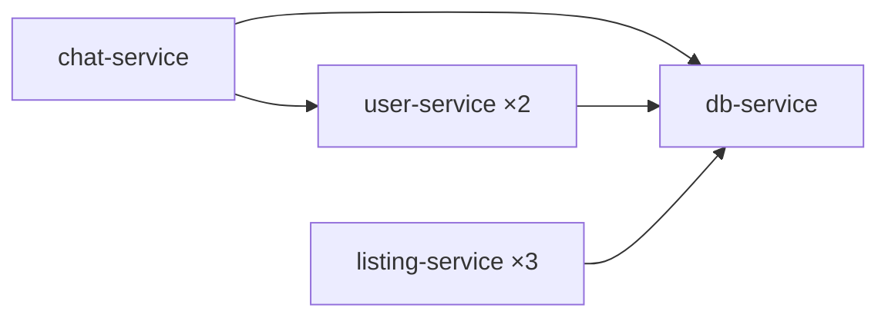

# ts-docker-orchestrator

A tiny, typed orchestrator that turns a folder of Dockerfiles into a running, self-networked
microservice fleet. Point it at a directory, and every subfolder with a `Dockerfile` gets built,
started, wired into a shared Docker network with name-based discovery, and — if it gets busy —
scaled out automatically.

No Kubernetes, no Compose file, no service mesh. Just folders in, containers out.

## Features

- **Folder-to-fleet** — any subfolder containing a `Dockerfile` becomes a running container. No
  manifest to maintain.
- **Zero-config service discovery** — services call each other by container name
  (`http://user-service:3000`) over a shared user-defined Docker network. No DNS setup, no reverse
  proxy, no service mesh — it's a built-in Docker feature.
- **Built-in load balancing** — replicas of the same service share one network alias, so Docker's
  embedded DNS round-robins requests between them for free.
- **CPU-based autoscaling** — a service pegging its CPU gets another replica spun up
  automatically, up to a configurable cap.
- **Declarative one-off APIs** — `startService()` spins up a [Hono](https://hono.dev) server on an
  auto-picked free port. Declare a port (or don't) and one or more route handlers; that's the
  whole API.
- **Clean shutdown** — `SIGINT`/`SIGTERM` stop and remove every container the orchestrator
  started. No orphaned containers left behind.
- **Fully typed** — strict TypeScript throughout, including a typed Docker Engine API via
  [dockerode](https://github.com/apocas/dockerode).

> [!NOTE]
> Requires a running Docker daemon reachable at `/var/run/docker.sock`.

## Getting started

**Prerequisites:** Node.js 20+, [Yarn](https://yarnpkg.com), and Docker.

```bash
yarn install
yarn start [folder]   # defaults to the current directory
```

Everything under `[folder]` gets scanned recursively; the first `Dockerfile` found in a branch
marks that folder as a service (nested Dockerfiles below it are not rescanned).

## Usage

### Building a fleet from folders

```
my-services/
├── auth-service/
│   └── Dockerfile
└── billing-service/
    └── Dockerfile
```

```bash
yarn start my-services
```

```
┌─────────┬──────────────────┬────────────────────┬──────────────┬──────────────────────┐
│ (index) │ service          │ container           │ host port(s) │ in-network address   │
├─────────┼──────────────────┼────────────────────┼──────────────┼──────────────────────┤
│ 0       │ 'auth-service'   │ 'auth-service-1'    │ '32771'      │ 'auth-service:8080'  │
│ 1       │ 'billing-service'│ 'billing-service-1' │ '32772'      │ 'billing-service:80' │
└─────────┴──────────────────┴────────────────────┴──────────────┴──────────────────────┘
```

`billing-service` can now reach `auth-service` with a plain `fetch('http://auth-service:8080/...')`
— no client-side service discovery library required.

### Running multiple replicas

Drop a `replicas.txt` file (just a number) next to a service's `Dockerfile` to start it with
several identical, load-balanced instances from the beginning:

```
listing-service/
├── Dockerfile
└── replicas.txt   # "3"
```

All three containers share the `listing-service` network alias, so requests to
`http://listing-service:3000` are distributed across them automatically.

### Autoscaling

Every 10 seconds, the orchestrator samples each service's CPU usage. A replica averaging above the
threshold gets a sibling — same image, same alias — up to a cap:

| Setting                   | Default | Location                                           |
| ------------------------- | ------: | --------------------------------------------------- |
| Scale-up CPU threshold    |     70% | `SCALE_UP_CPU_PERCENT` in `src/orchestrator.ts`     |
| Max replicas per service  |       3 | `MAX_REPLICAS` in `src/orchestrator.ts`             |
| Check interval            |     10s | `SCALE_CHECK_INTERVAL_MS` in `src/orchestrator.ts`  |

### Declarative microservices with Hono

Skip the Dockerfile entirely for a quick in-process API. Declare one endpoint with `handler`, or
several with `routes`:

```ts
import { startService } from './src/microservice.js';

await startService({
  name: 'status',
  port: 3000, // omit it and a free port is picked for you
  routes: {
    '/status': () => ({ ok: true, uptime: process.uptime() }),
    '/ping': () => 'pong',
  },
});
```

Return a plain object (serialized to JSON) or a raw `Response`. Any path not listed in `routes`
gets a 404.

### Reaching a container-built service from host code

`startService()` runs on the host, not on `orchestrator-net`, so it can't call
`http://listing-service:3000` by name the way containers call each other — that name only
resolves inside the Docker network. Use `getHostPort()` to look up the port the orchestrator
published for it instead:

```ts
import { launchFolder, getHostPort } from './src/orchestrator.js';
import { startService } from './src/microservice.js';

await launchFolder('src-test/car-marketplace');

await startService({
  name: 'status',
  port: 3000,
  routes: {
    '/listings': async () => {
      const hostPort = await getHostPort('listing-service');
      if (!hostPort) return new Response('listing-service is not running', { status: 502 });
      const upstream = await fetch(`http://localhost:${hostPort}/listings`);
      return new Response(await upstream.text(), { status: upstream.status });
    },
  },
});
```

`GET http://localhost:3000/listings` now proxies through to whichever `listing-service` replica
Docker picks. This is exactly what [`src/index.ts`](src/index.ts) does.

## Example: car marketplace

[`src-test/car-marketplace/`](src-test/car-marketplace/) is a small, runnable example built on the
orchestrator itself — four independent Node services that only know about each other by name:



- **db-service** — the single source of truth for cars, users, and messages.
- **listing-service** *(3 replicas)* — proxies car listings from `db-service`; returns which
  replica answered, so you can watch the round-robin in action.
- **user-service** *(2 replicas)* — proxies user data from `db-service`.
- **chat-service** — validates both sides of a conversation via `user-service`, then writes the
  message through `db-service`: a multi-hop call across three services.

Run it:

```bash
yarn start src-test/car-marketplace
```

> [!TIP]
> This example doubles as the orchestrator's integration test fixture — see
> [`src-test/orchestrator.test.ts`](src-test/orchestrator.test.ts) for it being built, scaled, and
> torn down against a real Docker daemon.

## Project structure

```
src/
├── docker.ts         Docker Engine client (dockerode)
├── scan.ts           Finds Dockerfile folders under a root
├── network.ts        Shared user-defined bridge network
├── stats.ts          CPU % from raw container stats
├── orchestrator.ts   Build, run, scale, and tear down services
├── microservice.ts   Declarative Hono service helper
└── index.ts          CLI entry point

src-test/
├── car-marketplace/  Example multi-service fixture (see above)
└── *.test.ts         Integration tests against a real Docker daemon
```

## Development

```bash
yarn build        # type-check and emit to dist/
yarn typecheck     # type-check src/ and src-test/ without emitting
yarn lint           # eslint
yarn format          # prettier --write
yarn test             # run the test suite
yarn coverage          # run the test suite with coverage
```

Tests use Node's built-in [`node:test`](https://nodejs.org/api/test.html) runner, run against a
real Docker daemon rather than mocks — including a full build → scale → shutdown cycle on the car
marketplace fixture.

> [!WARNING]
> This is a demo/learning project, not a production orchestrator: no TLS, no auth on any exposed
> service, and the example services keep their data in memory. Treat it as a starting point, not a
> deployment target.
